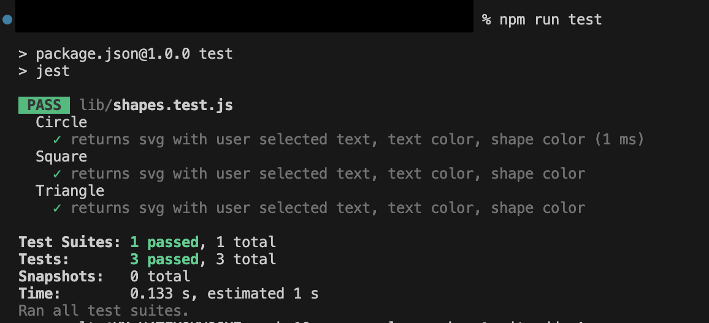

# Week-10 (OOP): SVG Logo Maker Application

The task is to build a Node.js command line application that takes in user input to generate a logo and save it as an SGG file. The application prompts the user to select a  text, text color, shape color the saves the logo to the examples folder. 

## User Story

```md
AS a freelance web developer
I WANT to generate a simple logo for my projects
SO THAT I don't have to pay a graphic designer
```

# Technologies used

* JS
* Node.js
* Inquirer version 8.2.4 package
* Jest

# How to Use 

On the Visual Studio terminal do the following: 

* git clone https://github.com/mayperalta/week-10-oop-svg-logo-maker.git
* npm init
* npm i jest
* npm i inquirer@8.2.4
* node index.js 
* enter responses
* view SVG file on browser
* npm run test


## Mock-Up

The following image shows a mock-up of the generated SVG given the following inputs:

Circle - `ABC` for the text, `#FFFFFF` for the text color, `circle` from the list of shapes, and `green` for the shape color. 


Square - `ABC` for the text, `#FFFFFF` for the text color, `circle` from the list of shapes, and `red` for the shape color. 


Triangle - `ABC` for the text, `#FFFFFF` for the text color, `circle` from the list of shapes, and `blue` for the shape color. 


The below image shows the results from an `npm run test`.



The video below demonstrates how the application works. It also includes an `npm run test`, showing whether the script successfully renders the expected output.  


Wath Video here - [https://drive.google.com/file/d/1JYjQUUPK7XoxFQX-5O9YlQWpMRzbJkvb/view?usp=sharing](https://drive.google.com/file/d/1JYjQUUPK7XoxFQX-5O9YlQWpMRzbJkvb/view?usp=sharing)

# Repository

The URL of the GitHub repository, with a unique name and a README describing the project:

View [GITHub Repo here](https://github.com/mayperalta/week-10-oop-svg-logo-maker)


